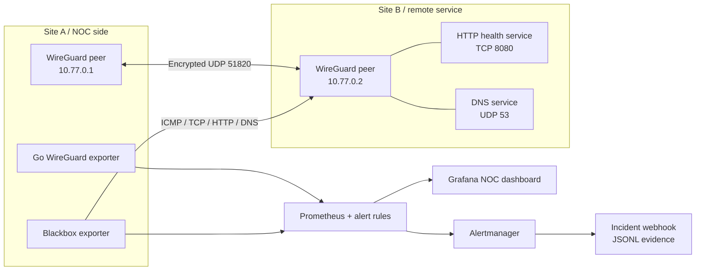

# VPN NOC Operations Lab

[](https://github.com/IzzaldinSamir/vpn-noc-operations-lab/actions/workflows/ci.yml)
[](https://go.dev/)
[](https://www.wireguard.com/)
[](https://prometheus.io/)
[](https://grafana.com/)
[](LICENSE)

A reproducible network-operations lab built around an encrypted WireGuard tunnel. It monitors tunnel state, handshake freshness, traffic counters, reachability, latency, TCP service availability, HTTP health, and DNS resolution. Alertmanager records firing and resolved incidents, while repeatable fault-injection drills exercise an L1/L2 response workflow.

The project is intentionally operational rather than decorative: configuration, dashboards, alert rules, exporter code, tests, runbooks, incident evidence, and CI are all version controlled.

## What it demonstrates

- Linux VPN configuration with WireGuard, routes, peers, keys, `AllowedIPs`, keepalives, and MTU settings
- Network monitoring with Prometheus, Blackbox Exporter, Grafana, and Alertmanager
- A custom Go exporter that converts `wg show all dump` into Prometheus metrics
- Synthetic ICMP, TCP, HTTP, and DNS probes across the encrypted tunnel
- Alert correlation across interface, handshake, reachability, service, DNS, and latency failure domains
- NOC workflows: triage, packet capture, recovery, escalation, incident logging, and post-incident review
- Automated configuration validation, unit tests, dashboard provisioning, and live integration testing

## Architecture



`site-a`, the custom exporter, and Blackbox Exporter share one network namespace. This lets the probes observe the same `wg0` interface and routing table an operator would troubleshoot on a VPN gateway.

## Quick start

### Requirements

- Linux host or Linux VM with WireGuard kernel support
- Docker Engine and the Docker Compose plugin
- Go 1.24 or newer for ephemeral key generation
- `curl`, `jq`, and `make` for operator commands

Docker Desktop on Windows must use the WSL2 backend. Run the lab inside a WSL2 distribution with WireGuard support.

```bash
git clone https://github.com/IzzaldinSamir/vpn-noc-operations-lab.git
cd vpn-noc-operations-lab

make init
make up
make smoke
```

`make init` creates fresh X25519 key pairs and renders both peer configurations under the ignored `runtime/` directory. Private keys are never committed.

Open the provisioned **VPN NOC Operations Overview** dashboard at <http://localhost:3000>. Anonymous access is read-only. Local credentials default to `admin` / `vpn-noc-local-only` and can be changed in `.env`.

## Monitored signals

| Signal | Source | Failure meaning |
|---|---|---|
| Interface state | Custom Go exporter | `wg0` is missing or unreadable |
| Handshake state and age | WireGuard peer telemetry | Peer configuration, endpoint, UDP path, or key problem |
| Received/transmitted bytes | WireGuard peer telemetry | Tunnel traffic and rate evidence |
| ICMP success and duration | Blackbox Exporter | Path reachability or latency incident |
| TCP connect to `8080` | Blackbox Exporter | Remote listener or path problem |
| HTTP body and status | Blackbox Exporter | Application health problem |
| DNS answer over UDP | Blackbox Exporter | DNS listener, record, or tunnel-path problem |
| Scrape target health | Prometheus | Monitoring visibility problem |

## Service endpoints

Every published port binds to loopback by default.

| Service | Endpoint | Purpose |
|---|---|---|
| Grafana | <http://localhost:3000> | Eight-panel VPN operations dashboard |
| Prometheus | <http://localhost:9090> | Metrics, targets, queries, and alert rules |
| Alertmanager | <http://localhost:9093> | Alert grouping, silences, and resolution state |
| Blackbox Exporter | <http://localhost:9115> | Synthetic probe diagnostics |
| VPN exporter | <http://localhost:9586/metrics> | WireGuard interface and peer metrics |
| Incident webhook | <http://localhost:8081/alerts> | Last 20 stored webhook records |

## Incident drills

The drills deliberately create a fault and leave the environment in that state long enough to inspect alerts and evidence.

```bash
make drill-peer-down       # correlated tunnel, reachability, DNS, and service incident
make drill-service-down    # service-layer failure with the tunnel still available
make drill-dns-failure     # DNS-only failure
make drill-latency         # 300 ms delay on wg0

make recover               # remove injected state and restart the remote services
make smoke                 # verify complete recovery
```

Follow [RUNBOOK.md](RUNBOOK.md) during each drill. Use the [incident report template](docs/incident-report-template.md) to record detection, evidence, root cause, recovery, and follow-up actions.

## Validation and CI

```bash
make validate
```

The validation pipeline checks:

- Go formatting, unit tests, race detection, and `go vet`
- WireGuard dump parsing and Prometheus metric generation
- Shell syntax and ShellCheck findings
- Docker Compose rendering
- Prometheus configuration, alert rules, and rule behaviour fixtures
- Alertmanager configuration
- Grafana dashboard JSON
- A live build and end-to-end smoke test of the complete tunnel and monitoring stack

## Repository layout

```text
.
├── cmd/
│   ├── incident-webhook/       # Local Alertmanager evidence sink
│   ├── keygen/                 # Ephemeral X25519/WireGuard configuration generator
│   └── vpn-exporter/           # WireGuard-to-Prometheus exporter and tests
├── docs/                       # Incident report template
├── lab/node/                   # Linux VPN peer image and entrypoint
├── monitoring/
│   ├── alertmanager/           # Alert routing
│   ├── blackbox/               # ICMP, TCP, HTTP, and DNS probe modules
│   ├── grafana/                # Provisioned data source and dashboard
│   └── prometheus/             # Scrape jobs, alerts, and rule tests
├── scripts/                    # Health, smoke, validation, and drill automation
├── compose.yaml                # Complete lab topology
└── RUNBOOK.md                  # L1/L2 incident procedures
```

## Security boundary

This is an isolated local training environment, not a production VPN appliance. Host ports bind to `127.0.0.1`; private keys are generated locally and ignored by Git; monitoring containers use read-only filesystems where practical. The two VPN peers require `NET_ADMIN` to create interfaces and inject controlled faults. Do not reuse generated keys, default credentials, routing assumptions, or anonymous Grafana access outside the lab.

## Resume-ready summary

> Built a reproducible WireGuard VPN operations lab with Prometheus, Blackbox Exporter, Grafana, Alertmanager, a custom Go metrics exporter, synthetic ICMP/TCP/HTTP/DNS checks, nine alert rules, controlled failure drills, CI validation, and an L1/L2 incident runbook.

Built by [Izzaldin Samir](https://github.com/IzzaldinSamir).
